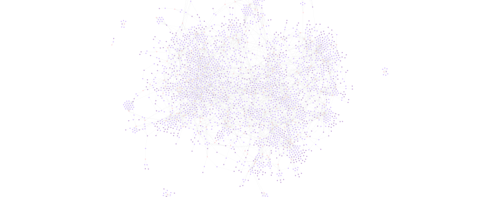
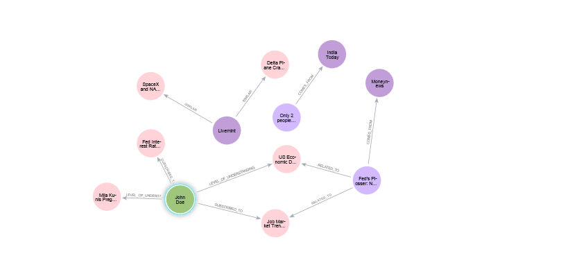
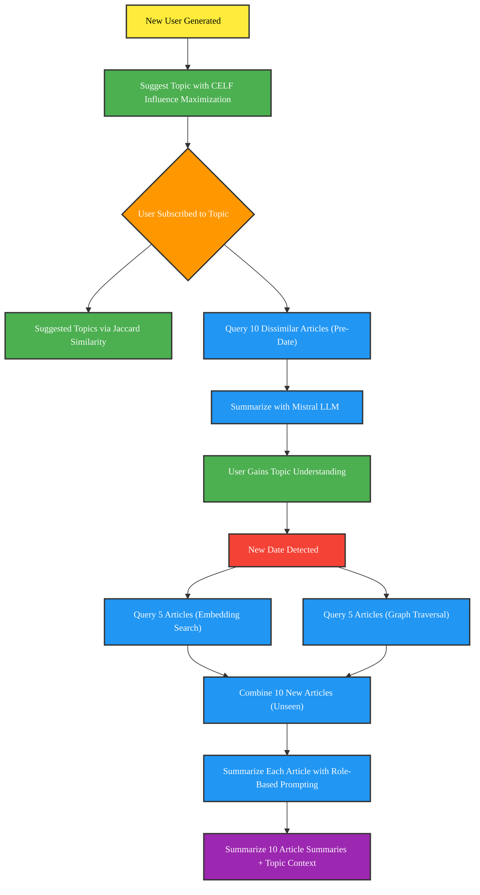

# Personalized Topic-Specific News Feed

## Overall Goal
Provide the user with a personalized topic-specific news feed.  
For **new users**, a brief history of the topic will be generated to offer appropriate context.  
For **returning users**, a summarization of new articles is provided, ensuring that only novel information is highlighted.

## Features

### Topic Modelling
- Applies **BERTopic** for topic modeling.
- Enhanced with:
  - `CountVectorizer` to remove stopwords and add bigrams.
  - `UMAP` for dimensionality reduction.
  - Tuned `HDBSCAN` for better clustering.
  - Keyword-to-topic conversion using **LLMs**.

### Graph + Embedding Search
- Stores articles in a **Neo4j graph database**.
- Embeddings generated using `nomic-embed-text`.
- Retrieves articles using a **hybrid approach**:
  - **Graph traversal** for structured, topic-grounded exploration.
  - **Embedding similarity** for broader semantic relevance.
- Topic suggestions powered by:
  - **Jaccard Similarity**
  - **CELF Influence Maximization**

### Summarization System
- Utilizes **Ollama (Mistral)** for summarizing articles via role-based prompting.
- Maintains **history-based summaries** using Max-Min greedy selection to track topic updates over time.

### Intent Detection
- Determines article intent with **LangChain** and **role-based prompting**.
- Uses **Pydantic** for structured, JSON-formatted output.

### Retrieval-Augmented Generation (RAG)
- Integrates **Neo4j** and **LLMs** to generate enriched, context-aware topic summaries and query responses.

## Visualization

### Graph Overview


Our Neo4j database contain the following nodes:
- **Article**: Represents a news article.
- **Topic**: Represents a topic of interest.
- **Channel**: Represents the source of the article.
- **User**: Represents the user of the system.

These nodes are connected by the following relationships:
- **RELATED_TO**: Connects an article to its topic.
- **COMES_FROM**: Connects an article to its source.
- **SUBSCRIBES_TO**: Connects a user to their subscribed topics.
- **LEVEL_OF_UNDERSTANDING**: Connects a user to their understanding of a topic.
- **SIMILAR**: Connects similar nodes together. Generated by the Jaccard Similarity algorithm.



### Flowchart


## Tech Stack

Our project is built using a modern and modular tech stack:

- **Frontend**: Vue.js with Tailwind CSS and PrimeVue for a responsive, interactive UI
- **Backend**: Python with Flask for API services and integration
- **Local LLMs**: Served via [Ollama](https://ollama.com/) using open-source [Mistral](https://ollama.com/library/mistral) models
- **Graph Database**: [Neo4j](https://neo4j.com/) for knowledge grounding, topic linkage, and graph-based querying
- **GenAI Pipeline**: [LangChain](https://www.langchain.com/) for structured prompting, RAG, and LLM workflow management
- **Embeddings**: Generated using `nomic-embed-text` for scalable vector representation of articles

## Prerequisites

- [Node.js](https://nodejs.org/) (v18+)
- [Python](https://www.python.org/downloads/) (v3.10+)
- [Ollama](https://ollama.com/download)
- [Neo4j Desktop](https://neo4j.com/)
- [Docker Desktop](https://www.docker.com/products/docker-desktop)

## Getting Started

### 1. Clone the Repository
### 2. Set up Backend

```bash
cd backend
python -m venv venv
venv\Scripts\activate         # On Windows
# Or: source venv/bin/activate  (Linux/macOS)

pip install -r requirements.txt
python app.py
```

```bash
# Remember to download OLLAMA at https://ollama.com/download
ollama serve
ollama pull mistral
ollama pull nomic-embed-text
```

```
python neo4j_loader.py
python neo4j_graph_calc.py
```

```bash
cd backend
docker compose up -d
```

If you are using Colima, do these steps prior:
```bash
brew install docker-compose
colima start
```

### 3. Set up Frontend 
```bash
cd frontend
npm install
npm run dev
```
### 4. Set up environment variables
- Create a `.env` file in the `backend` directory.
- Add the following variables:

    ```env
    NEO4J_URI=bolt://localhost:7687
    NEO4J_USER=neo4j
    NEO4J_PASSWORD=your_password
    PORT=5000
    ```

- Create a `.env` file in the `frontend` directory.
- Add the following variable:

```env
VITE_API_URL=http://127.0.0.1:5000
``` 

### Closing the project:
```bash
docker compose down
colima stop # If using Colima
```
